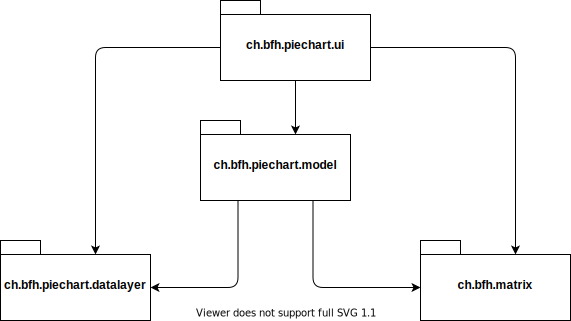
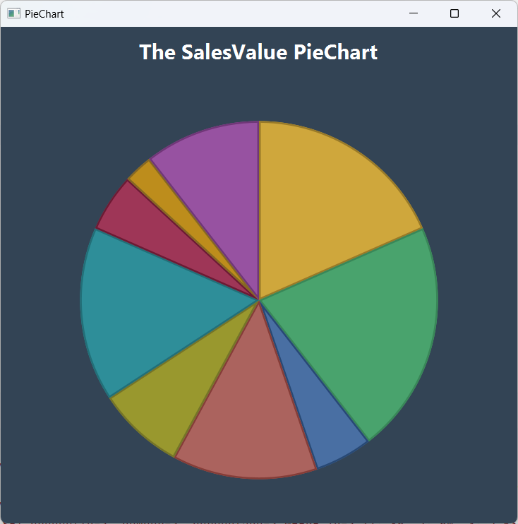
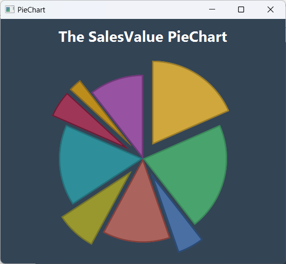

# Project & Training 2: Pie Chart

[ Block 2 - Programming, Mathematics - Version 2024-02-21 ]

## Goal

The goal of this exercise is to implement a program that calculates and visualizes a pie chart
diagram based on values stored in a database. An existing library for creating
charts may not be used for this. The intention is that the underlying mathematical concepts
are understood and can be implemented in a corresponding Java program.

To simplify the setup of your development environment, an in-memory database is used
as a source for the sales values. To set up the database with some values, the values are
read from file `salesvalues.txt` located in `src/main/resources` and inserted in the database.


## Package Structure

This application is structured in several Java packages. Complete and test your code
by starting with the packages having no dependency to other packages except standard
Java packages. Then complete the classes of the next package having dependencies to
one or more fully implemented and tested packages of the application.



## Tasks

It is suggested that you complete the tasks in the order given next, see also the
corresponding remark in section *Package Structure* above.

### Class `Matrix`

Implement the class `Matrix`. Instances of this class represent matrices with double
values and methods providing basic operations on matrices:

- Implement basic operations, i.e. methods `transpose()`,
  `multiply(scalar)`, `multiply(matrix)`, and `add(matrix)`
- Furthermore, implement
	- the constructor;
	- getter methods `getNbOfLines()`, `getNbOfColumns()`, and `get(line,col`;
	- correct `equals(obj)` and `hashCode()` methods
          (note that the `equals(obj)` method is used to compare matrix values in unit tests);
	- optionally the `toString()` method
          (may be useful for debugging);
	- `Matrix` objects have to be immutable;
	- when a method cannot run correctly due to non-satisfied conditions, it has to
      throw an exception.

A corresponding test class is given for this class.


### Class `SalesValueRepository`

This class interfaces to the database. It provides methods the classic CRUD methods:
- 'C' for creating sales values records;
- 'R' for reading sales values records;
- 'U' for updating sales values records; and
- 'D' for deleting sales values records.

Upon creation of a sales value record, a unique primary key value is provided by the
database. The corresponding value of field `id` of the corresponding `SalesValue` object
is set accordingly.

Your task is to provide the JDBC-SQL prepared statements given as constants
in this class.

A corresponding test class is given for this class.

### Class `DataProvider`

Implement the `DataProvider` class to provide sales value information:

- Implement a `static` block. A static block is executed upon loading the
  class, thus, it initializes the class and/or its context according to
  the instructions of given in the static block. The static block performs
  the following steps:

  1. It makes a connection to the database using the `ConnectionManager`;
  2. It reads all sales values available;
  3. It computes the relative percentage for the sales values;
  4. It updates the sales values in the database.

- Implement method `getSalesValueList()` which returns all sales values to the
  caller. Notice that upon calling this method, all sales values possess
  their corresponding percentage values due to the static block described
  above. This method is used in a test to verify that the relative
  percentage values are correctly calculated.

A corresponding test class is given for this class.

### Class `PieChartUIControl`

Implement the `PieChartUIControl` class:

- This class represents a pie chart UI Control and manages its slices (objects of class `CircleSector`).
- The class receive the SalesValues from the DataProvider via the method `addData()`.
- Based on the received values the angles of the slices are computed (in static method `getAngles`()))
  and the CircleSectors initialized.
- The method `resize()` is responsible for the repositioning the pie chart and the contained CircleSectors

A corresponding test class is given for this class.

### Class `CircleSector`

- The class `CircleSector` is a subclass of the JavaFX class `Path` (see https://openjfx.io/javadoc/17/javafx.graphics/javafx/scene/shape/Path.html)
- Each object of the class represents a slice in the pie chart.
- Managing the chart and its slices implies some graphical operations (rotation, scaling, and translation) to
  calculate positions in the window. Use your `Matrix` class and the given `GraphicOps` class to implement
  these operations. Using
  [**homogeneous coordinates**](https://towardsdatascience.com/understanding-transformations-in-computer-vision-b001f49a9e61) 
  may simplify this implementation.



Implement a detaching mechanism for the pie chart slices.

- Detaching means that the slice is moved away from the center of the chart.
  The detaching distance has to be 20% of the radius. You could use the given `DETACH_VECTOR`.
- The `onClick()` method should be called, when a slice is clicked.
  Use this method to toggle the detaching state.
  


A corresponding test class is given for this class.

### Class `Controller`
- This class is the Controller of the JavaFX Application (class `App`).
- It creates a new `PieChartUIControl` and assigns it to the pane.
- Pass the SaleValues from the `DataProvider` to the `PieChartUIControl` object. If this is done correctly, 
  the PieChart should show up.
<!-- - It queries the state (coordinates) of the pie chart
  using the methods defined in the two
  interfaces `PieChart` and `PieChartSlice`.
- When the state changes, the user interface has to be informed by calling
  the `notifyObservers(slice)` method.
- The controller informs the model about size changes of the pane by calling
  the `setPosAndRadius(x, y, r)` method.-->


### Class `App`

Finally, edit static method `main(String[] args)` in class
`App` according to the instructions given in the source code.


## Evaluation

- 3 points - Implementation of `Matrix` class:
    - 1 point when at least 8 tests are passed in `MatrixTest`.
    - 2 points when at least 10 tests are passed.
    - 3 points when all 12 tests are passed.
- 2 points - Implementation of `SalesValueRepository`:
    - 2 points when interfacing to the database works correctly.
- 1 point - Implementation of `DataProvider`:
    - 1 point when percentage values from the sales values from the database are
      correctly calculated. (Test case: `DataProviderTest.testPercentages()`) 
- 5 points - Implementation of the `PieChartUIControl` and `CircleSector` class:
    - 1 point when all tests in `PieChartUIControlTest` are passed.
    - 1 point when all tests in `CircleSectorTest` are passed.
    - 1 point when the pie chart and the heading shows up correctly in the window (with right orientation).
    - 1 point when the pie chart responds correctly to size changes.
    - 1 point when the heading is display similar to the screenshot.
- 2 points - Implementation of detaching mechanism:
    - 1 point when slices are correctly detached when clicked.
    - 1 point when detached slices are correctly resized when window size changes.
- 2 points - Good Practices 
    - 1 point if Checkstyle (`mvn checkstyle:check`) yields 0 violations and less than 20 warnings.
    - 1 point if there is a single commit for every logical change with a useful commit message (usually more than 20 commits in total)

Points sum up to a maximum of 15. The task is passed when **at least 12 points** are achieved.    

## Importing the Project into Eclipse

Git-clone the template application. Then import the application as a
Maven project ("Import..." -> "Maven" -> "Existing Maven Projects").

To run the application, select the Java source
file `App.java`, right-click and
select "Run As" -> "Java Application".

Initially, the application shows a simple window:


It is also possible to execute the sample JUnit test class `PieChartTest` given
in the test directory. Select the Java source
file `PieChartTest.java`, right-click and
select "Run As" -> "JUnit Test".


## Importing the Project into IntelliJ

Git-clone the template application. Then open/import the application
("Open or import" then navigate to the root of the application).

To run the sample application, select the Java source
file `App.java`, right-click and
select "Run 'App.main()' ".

A window as shown above will be displayed.

It is also possible to execute the sample JUnit test class `PieChartTest` given
in the test directory. Select the Java source
file `PieChartTest.java`, right-click and
select "Run 'PieChartTest' ".


## For Advanced Users: Maven Project

A working Maven project with JavaFX dependencies is given. To import it into your favorite IDE,
just import (in Eclipse) or open (in IntelliJ) the project. No prior JavaFX or Java module setup is required.

As long as tests do not run, compile and build the project with Maven, type:

```console
mvn clean compile
...
```
As soon as your tests run, you can add the `test` goal in the command above to form the following
command:

```console
mvn clean compile test
...
```

To execute the JavaFX app, first build the project (see above), then type:

```console
mvn javafx:run
...
```

To generate Javadoc API documentation, type:

```console
mvn clean compile javadoc:javadoc
...
```

You will find the generated HTML files in `./target/site/apidocs`. In your browser, open
file `./target/site/apidocs/index.html`.

> **Note:** To generate the Javadoc API documentation, you must
> type `mvn clean compile javadoc:javadoc` as Javadoc requires the
> compilation of the Java source files.


To run Checkstyle for checking the code quality, type:

```console
mvn checkstyle:check
```
